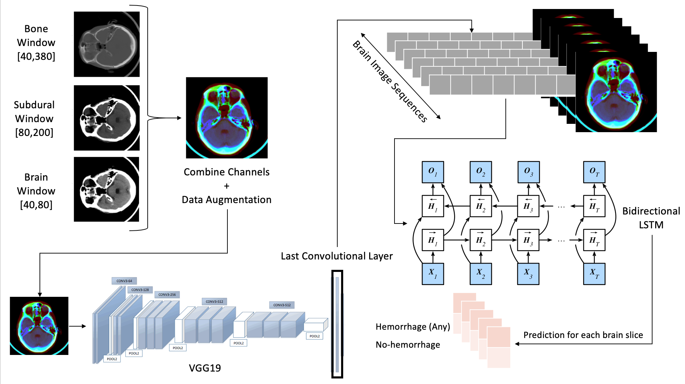

# hemorrhage-detection

This repository contains our implementation and training of a combined recurrent-convolutional DNN for intracranial hemorrhage (bleeding inside the brain) detection on CT scans.

The architecture that we have developed **vastly outperforms** the standard convolution-only approach: Our model achieves a recall (that is, it correctly detects bleeding) of 94% compared to a recall of 73% when only using a CNN.

The bidirectional recurrent neural network enables our model to incorporate information from CT slices of the brain above *and* below the current slice when predicting whether the current slice contains a hemorrhage or not. Of course, surrounding slices containing hemorrhages make it more likely for the current slice to also contain one (especially when the slices right above *and* right below show bleeding).

This work is a collaboration of Richard Qiu, Philippe Noël, Jonathan Berman, and Jorma Görns.

## Contents
* "Training the CNN.ipynb": Details the training of our feature extractor (specifically, a VGG19 CNN that we train to detect hemorrhages using transfer learning)
